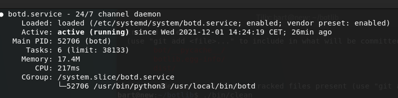

name
====

 **BOTLIB** - os level integration of bot technology.

synopsis
========

 | bot \<cmd\> \[key=value\] \[key==value\] 
 | bot cfg server=<server> channel=<channel> nick=<nick> 
 | bot -cv mod=irc,rss

 | (*) default channel is #botlib on localhost

description
===========

 A solid, non hackable bot, that runs under systemd as a 24/7 background
 service and starts the bot after reboot, intended to be programmable in a
 static, only code, no popen, no imports and no reading modules from a
 directory, way that **should** make it suitable for embedding.

install
=======

 pip3 install botlib

irc
---

 | bot cfg server=\<server\> channel=\<channel\> nick=\<nick\> 
 | bot -cv mod=irc,rss

 (*) default channel/server is #bot on localhost

sasl
----

 | bot pwd \<nickservnick\> \<nickservpass\>
 | bot cfg password=\<outputfrompwd\>

users
-----

 | bot cfg users=True
 | bot met \<userhost\>

rss
---

 bot rss \<url\>

24/7
----

 | cp /usr/local/share/botd/botd.service /etc/systemd/system  
 | systemctl enable botd --now

 | botctl cfg
 | cc=! channel=#botd nick=botd port=6667 server=localhost

 (*) default channel/server is #botlib on localhost

.. toctree::
    :hidden:
    :glob:

    *
